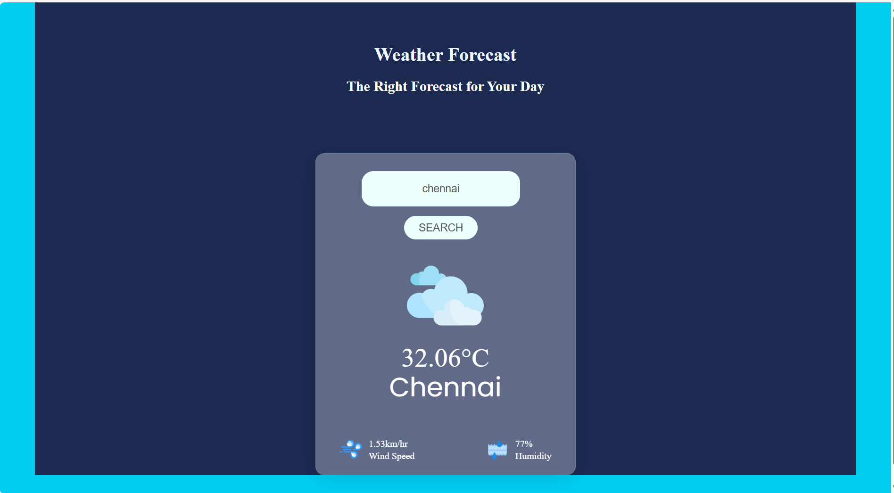

# Weather Forecast Application 🌦️

This project is developed as part of an 8-week internship under **CODTECH IT SOLUTIONS** in the domain of **MERN Stack Web Development**.

## 🌐 About the Project

The **Weather Forecast Application** is a dynamic web app that allows users to get real-time weather information for any city around the world. It provides a user-friendly interface with current temperature, weather conditions, humidity, and wind speed.

## 🚀 Technologies Used

- HTML5  
- CSS3  
- JavaScript  
- OpenWeatherMap API

## 📸 Project Outcome

## ⚙️ Features

- Search by city name to get weather data instantly  
- Real-time temperature and weather description  
- Displays humidity and wind speed  
- Interactive and responsive UI design
